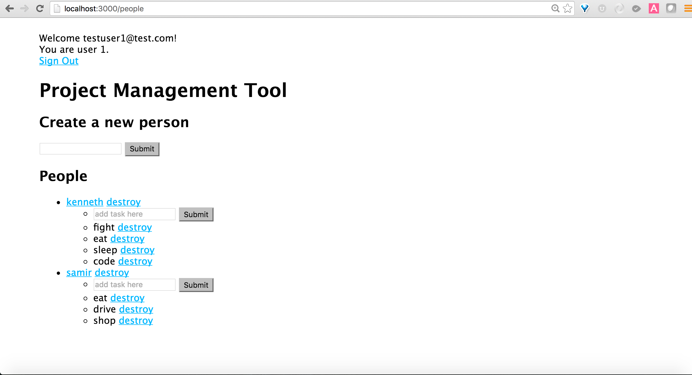

# README For This Project Management Tool App

You'll be extending this project management app. The app uses Node.js, Express.js (framework), MySQL (database), Sequelize (orm) and Handlebars (templating).

You'll be

* adding in delete links for tasks and people. But only if the user is logged in.

* adding in the appropriate route for the delete to work.

* If a person gets deleted, cascade the delete to extend to the tasks that the person owns.

* this is what the main page should look like if a user is signed in:



* you'll also add in this functionality:
  * when clicking a person on the front end, it will take you to a profile for the person showing all the tasks for that person. In addition, you'll be able to edit the person's name and update the person's name. Upon updating, it will redirect you back to this person's profile.
    * After complete The profile page will look like this:


## STEP ONE: READ THROUGH THIS README. FOLLOW THE INSTRUCTIONS

This repository demonstrates the usage of sequelize within an express application.

The implemented logic is a simple task tracking tool.

1. create a database called projects_db
  * `mysql -u root`
  * `create database projects_db;`

2. Adjust the `config/config.json` to fit your environment.

3. install modules in package.json
  * `npm install`

4. install sequelize cli globally to be able to run migrations on your computer:
  * `sudo npm install -g sequelize-cli`

5. run your migrations to create your tables
  * `sequelize db:migrate`

6. start up the app
  * `nodemon start`

  if you don't have nodemon
  * `npm start`

7. then in the browser go to http://localhost:3000


## The following parts are for your own knowledge. You don't need to do this to setup the app.

1. Want to create a migration:
  `sequelize migration:create create-<table name here>`

  edit the migration file

  to run the migration file:
    `sequelize db:migrate`

  You'll still have to make the model file in the models folder

2. curious of all the commands you can do with sequelize cli?
  go here: https://github.com/sequelize/cli

3. curious of all the sequelize relationships:
  http://docs.sequelizejs.com/en/latest/docs/associations/

4. In order to associate the models with each other, we changed the models like this:

  ```js
  // task.js
  // ...
  classMethods: {
    associate: function(models) {
      Task.belongsTo(models.Person);
    }
  }
  // ...
  ```

  ```js
  // person.js
  // ...
  classMethods: {
    associate: function(models) {
      Person.hasMany(models.Task)
    }
  }
  // ...
  ```
